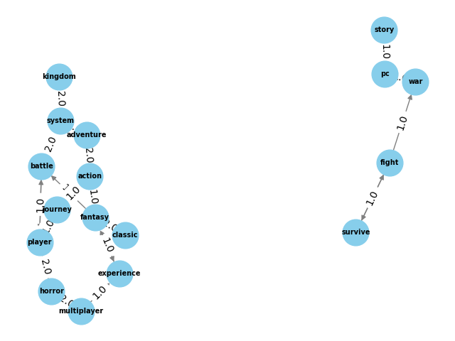

# Playalytics

Have you ever wondered what's hot in the current gaming world and which genres are making waves? As a video game enthusiast, I wanted to explore the popularity and I'm wondering whether professional critics' ratings correlate with sales.
With open data from Kaggle, I conducted a comprehensive analysis of each publisher's performance across various classic gaming categories, examining metrics including critic scores, sales figures, and the number of games published.
View lanjing0803.github.io/da3.html for details.

## Description

This repository serves as an archive for Python files used in my personal project. It contains scripts for data cleaning, analysis, and visualization, and other related images.

## Files

- `recommend_network/LDA.py`: Hot topics are analyzed within game descriptions that have received positive reviews
- `recommend_network/network.py`: Creating networks for keywords
Through Latent Dirichlet Allocation (LDA) analysis of the descriptions of top games with overwhelmingly positive user reviews in 2024, two distinct groups emerged.
One group revolves around themes of war, survival, and fight, appealing to players seeking intense action and strategic challenges. The other group is characterized by adventure, fantasy, and action, for gamers interested in storytelling and exploration.

- `KMeans.py`: The clusters indicate distinct patterns in the relationship between critic scores and sales figures. Informed by the elbow method, the optimal number of clusters (K) is 3. Cluster 1 suggests that products with higher critic scores tend to achieve greater sales success, while Cluster 3 represents products facing challenges in achieving both high sales and favorable critic scores. Cluster 2 represents a middle ground.

- `3dScatterPlot.py`: Explore how game publishers perform across various genres in the dynamic gaming industry. Using Plotly.js, I analyzed key metrics like critic scores, sales, and game releases to build a 3D model. Through the application of z-scores for normalization, I standardized the comparison process, comprehensively assessing publishers' overall performance.

